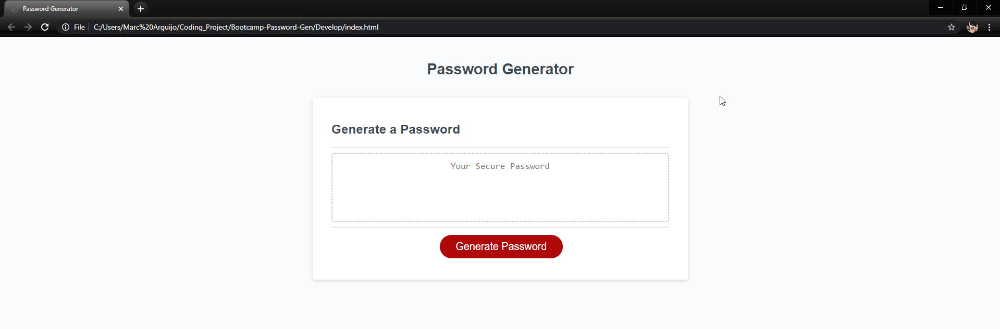
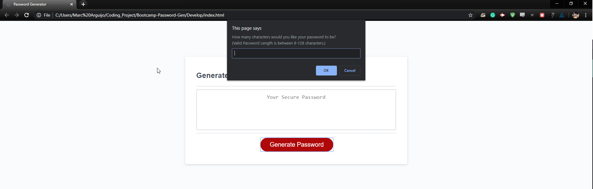
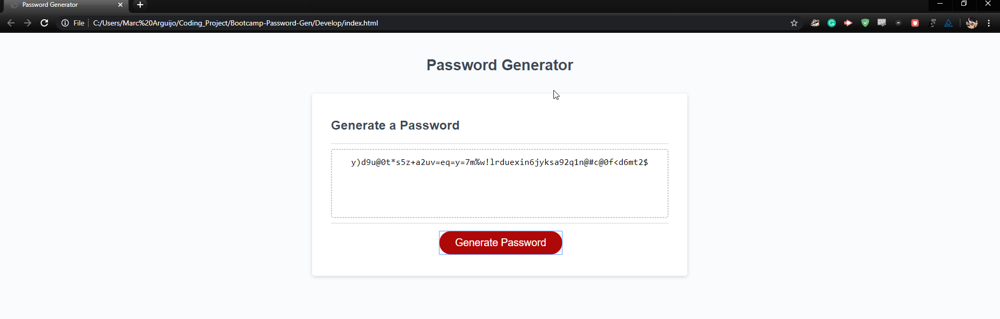

# Bootcamp: Random Password Generator

## Site Link

[Random Password Generator](https://on-your-marc-go.github.io/Bootcamp-Password-Gen/)

## Description

Passwords. Everyone has one and everyone needs one to access various different systems. Whether it be logging into Facebook or access a very secure server, it is best practice to have unique password that is difficult to replicate. The purpose of this project was to create application that would create a password utilizing criteria the user designated.

Key takeaways on this project were the utilization of functions, initializion of objects with properties, use of conditional logic to evaluate conditions, and implementation of loops to process actions. The application starts simply enough with asking how long the user wants to have the password and what kind of characters they want it to be comprised of (uppercase, lowercase, numbers, etc.). At least one is needed to generate the password so we implement validation logic to ensure the user follows the prompts correctly.

With all our choices in tow, an object is created continaing those choices as properties. Utilzing that object we are able to generate a password by checking the properties, loading the designated characters into an array and then random selecting characters to add to our password through a 'for' loop.

The end result is a password output to the screen for the user to view, copy/paste, and move about their business.

## Table of Contents (Optional)

If your README is very long, add a table of contents to make it easy for users to find what they need.

- [Installation](#installation)
- [Example](#example)
- [Credits](#credits)
- [License](#license)

## Installation

1. From the Repo screen clone this repository to your local machine. Assuming you have a valid git terminal and SSH key, you can utilize the SSH URL provided along with the 'git clone' command.
2. Open the repo in whatever development environment you so choose (ex. Visual Studio Code)
3. Once viewing the source you may open in your default browser to view and inspect the page as you see fit.

Alternatively you may refer to the 'Site Link' provided above to visit the site as it has been depoloyed via GitHub Pages.

## Example

- From the intial screen the only option you'll have is to click the button given.

- Upon clicking the button, you will be taken through a series of prompts asking for what you wish you password to be comprised of.

- At the end of the prompts, a randomly generated password will be given to you on the screen. You may choose to generate another one or copy/paste what is given and close the application.

## Credits

- [MDN Webdocs for general reference](https://developer.mozilla.org/en-US/)

- [Stackoverflow: Array Random string selection](https://stackoverflow.com/questions/7350363/select-a-random-string-from-an-array)

## License

MIT License

Copyright (c) 2020 Marc Arguijo

Permission is hereby granted, free of charge, to any person obtaining a copy
of this software and associated documentation files (the "Software"), to deal
in the Software without restriction, including without limitation the rights
to use, copy, modify, merge, publish, distribute, sublicense, and/or sell
copies of the Software, and to permit persons to whom the Software is
furnished to do so, subject to the following conditions:

The above copyright notice and this permission notice shall be included in all
copies or substantial portions of the Software.

THE SOFTWARE IS PROVIDED "AS IS", WITHOUT WARRANTY OF ANY KIND, EXPRESS OR
IMPLIED, INCLUDING BUT NOT LIMITED TO THE WARRANTIES OF MERCHANTABILITY,
FITNESS FOR A PARTICULAR PURPOSE AND NONINFRINGEMENT. IN NO EVENT SHALL THE
AUTHORS OR COPYRIGHT HOLDERS BE LIABLE FOR ANY CLAIM, DAMAGES OR OTHER
LIABILITY, WHETHER IN AN ACTION OF CONTRACT, TORT OR OTHERWISE, ARISING FROM,
OUT OF OR IN CONNECTION WITH THE SOFTWARE OR THE USE OR OTHER DEALINGS IN THE
SOFTWARE.

© 2029 Marc Arguijo All Rights Reserved.
